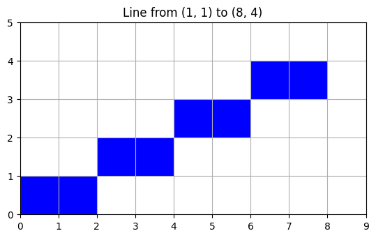
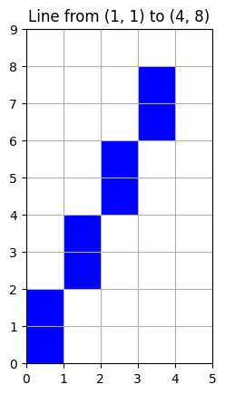
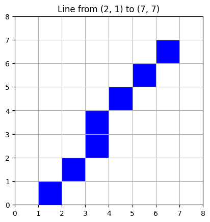
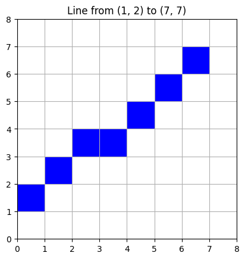

# Bresenham's Line Drawing Algorithm

## Overview

This implementation of the Bresenham's Line Drawing Algorithm in Python handles lines with different slope ranges: 0 < m < 1 and m > 1.

## Modifications for Slopes m > 1

The traditional Bresenham's algorithm is designed for slopes between 0 and 1. For steeper slopes (m > 1), the algorithm is adjusted by swapping the roles of x and y. This means that for each incremental step in y, the corresponding x is calculated. This modification ensures that the algorithm works efficiently for lines with steep slopes.

## Outputs
The algorithm was tested with the following cases:

### Case 1: Line from (1,1) to (8,4) - Represents a slope where 0 < m < 1

### Case 2: Line from (1,1) to (4,8) - Represents a slope where m > 1

### Case 3: Line from (2,1) to (7,7)

### Case 4: Line from (1,2) to (7,7)

In each case, the algorithm successfully plotted the line with the correct set of points.
